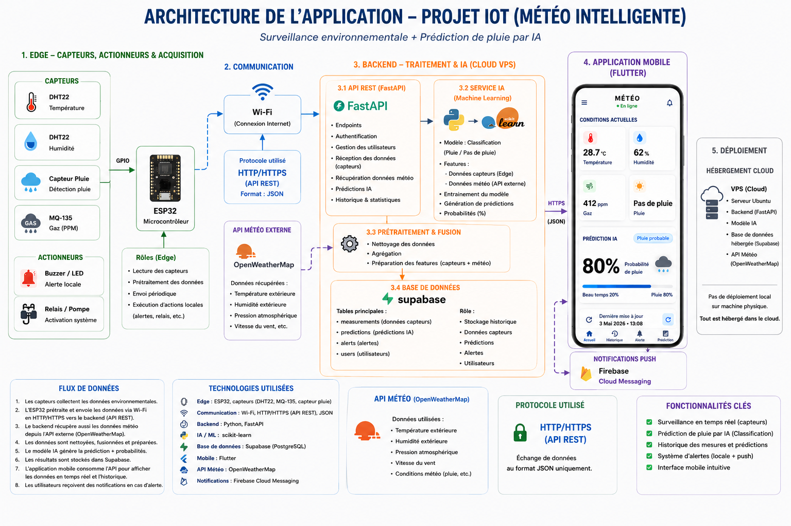
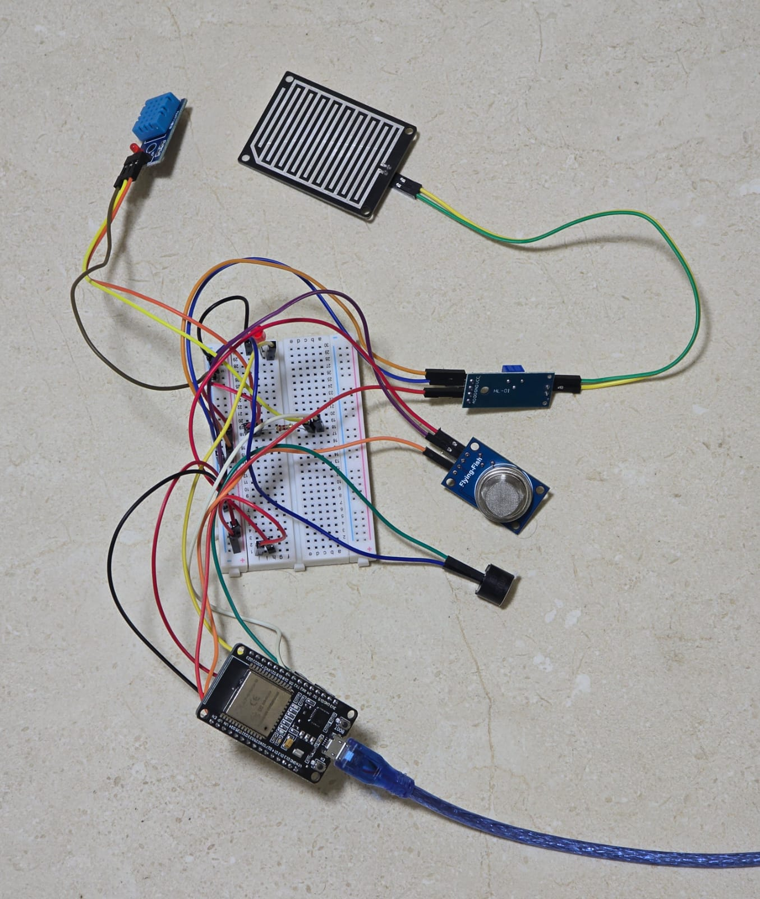
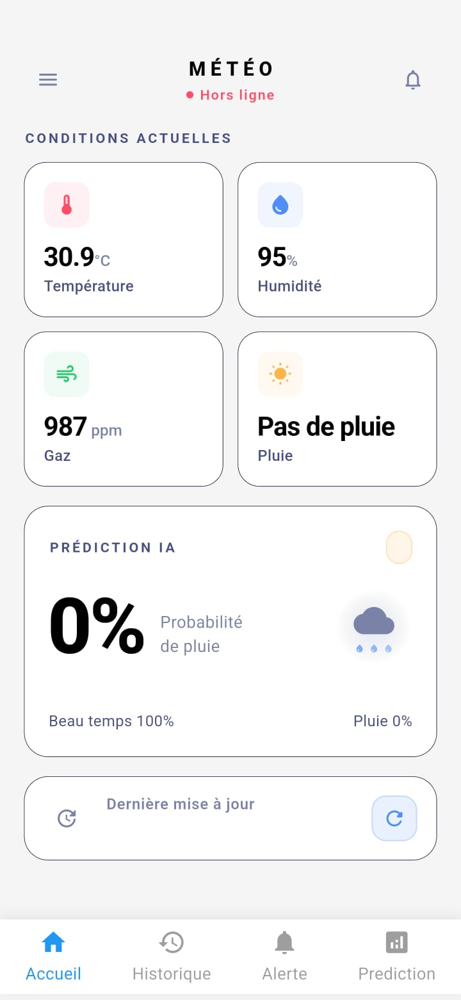
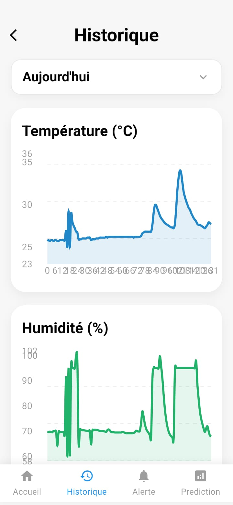
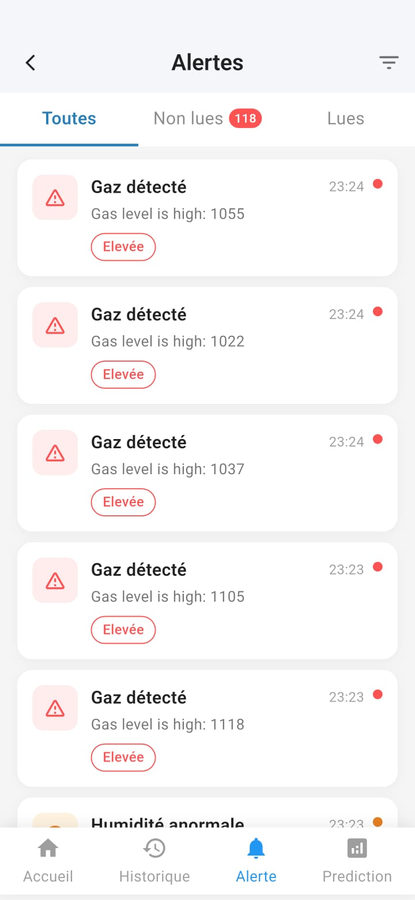
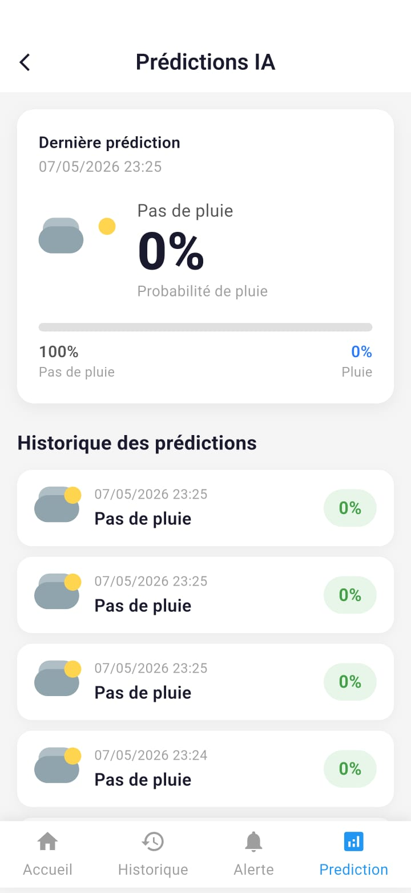
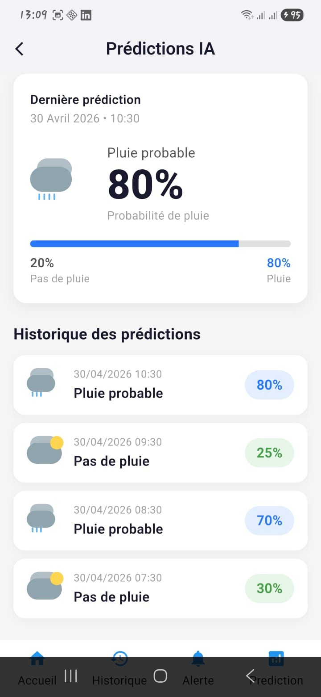
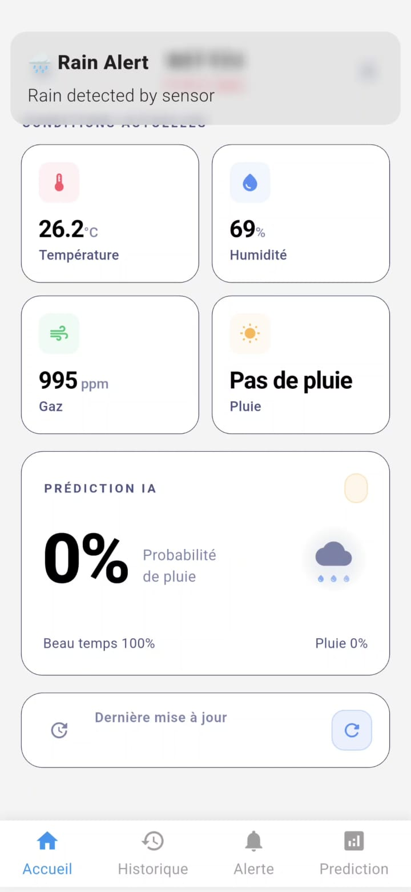
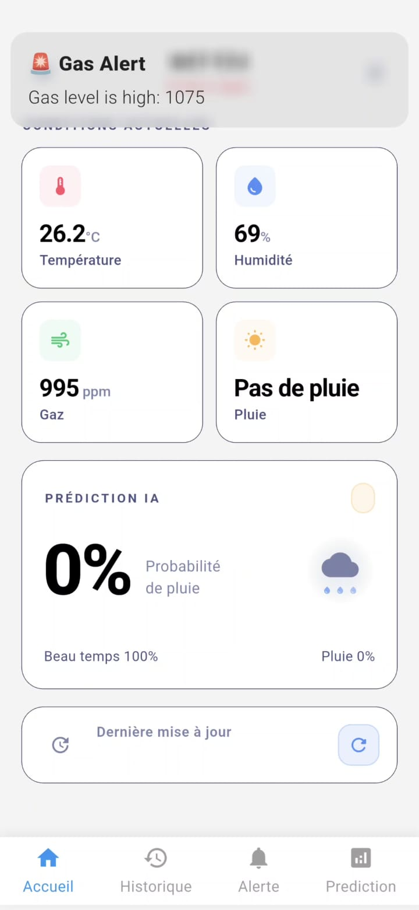

# 📌 IoT Smart Environment Monitoring System

## 🧠 Description

Ce projet est un système intelligent de surveillance environnementale composé de :

* Un objet IoT (ESP32 + capteurs) pour la collecte de données
* Un backend Flask pour l'API, le traitement et le machine learning
* Une base de données Supabase pour stocker les mesures et les alertes
* Une application mobile Flutter pour les interfaces utilisateurs

---

## 🏗️ Architecture globale

```
ESP32 (capteurs IoT)
    ↓
Backend Flask (API, ML, alertes)
    ↓
Supabase (PostgreSQL)
    ↓
Application Flutter (UI mobile)
```

---

## 📸 Visuels du projet

### Architecture globale

<p align="center">
  
</p>

### Circuit et objets IoT

<p align="center">
  
</p>

## Interfaces

### Home

<p align="center">
  
</p>

### History

<p align="center">
  
</p>

### Alertes

<p align="center">
  
</p>

### Predictions

<p align="center">
  
  
</p>

### Notifications

<p align="center">
  
  
</p>

> Toutes les images de l'architecture et du circuit IoT se trouvent dans le dossier `Captures`.

---

## 📁 Structure du projet

```
iot-project/
├── backend/
│   ├── app.py
│   ├── config.py
│   ├── requirements.txt
│   ├── models/
│   ├── routes/
│   ├── services/
│   ├── utils/
│   └── saved_models/
├── front_endd/
│   ├── pubspec.yaml
│   ├── lib/
│   ├── android/
│   ├── ios/
│   └── web/
├── Captures/
│   ├── arch.png
│   ├── 0.jpeg
│   └── ...
└── README.md
```

---

## ⚙️ Installation des dépendances

### Backend

1. Ouvrir un terminal dans `backend/`
2. Créer et activer un environnement virtuel :

```powershell
python -m venv .venv
.\.venv\Scripts\Activate.ps1
```

3. Installer les dépendances Python :

```powershell
pip install -r requirements.txt
```

### Frontend Flutter

1. Ouvrir un terminal dans `front_endd/`
2. Installer les dépendances Flutter :

```powershell
flutter pub get
```

---

## 🚀 Démarrage du projet

### Lancer le backend

```powershell
cd backend
python app.py
```

Le backend sera disponible par défaut sur :

```text
http://127.0.0.1:5000
```

### Lancer l'application Flutter

```powershell
cd front_endd
flutter run
```

---

## 🖥️ Interfaces

* Interface backend : API REST Flask pour la collecte des mesures, les prédictions et les alertes
* Interface mobile : application Flutter affichant les mesures, les graphiques, les notifications et l'état du système

---

## 📡 Endpoints principaux

* `GET /test`
* `POST /measurements`
* `GET /measurements`
* `GET /predictions`
* `GET /alerts`

---

## 🔧 Notes

* Le projet utilise `supabase` pour la base de données et `firebase-admin` pour les notifications
* Si un fichier `.env` est requis, placez-le dans `backend/` avec les paramètres d'accès appropriés

---

## 👨‍💼 Auteurs

- **Ahmed Hamda** 
- **Yassine Dhuib** 
- **Ayoub Barkia** 
- Projet : **Smart Weather**
- Date : 2026


---

## 📄 Licence
Projet académique de système IoT, backend Python et application mobile Flutter.
